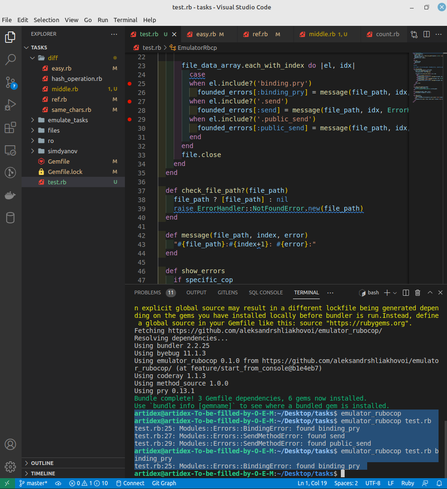

# EmulatorRubocop

## Installation

Install the gem and add to the application's Gemfile by executing:

    $ bundle add emulator_rubocop

If bundler is not being used to manage dependencies, install the gem by executing:

    $ gem install emulator_rubocop

Or add It to your gemfile

    $ gem 'emulator_rubocop', '0.1.0', git: 'https://github.com/aleksandrshliakhovoi/emulator_rubocop/', branch: 'dev'

## Usage

Now gem check three rules 'send', 'public_send', 'binding_pry', if those words presence in your files you see the specific error 

You can use gem from console by command 'emulator_rubocop'. The gem will check files in 'app' and web 'folder'

    run in console -> emulator_rubocop

 

Also you can specify file path and write in console relative_path if gem add to gemfile

    run in console -> emulator_rubocop test.rb

You can find only specific errors, so add one of errors for second argument 'send', 'public_send', 'binding_pry's

    run in console -> emulator_rubocop test.rb binding_pry

Or absolute_path if you use gem from irb

    run in IRB EmulatorRubocop.new(['/home/user/Desktop/tasks/test.rb']).call

emulator_rubocop/README.md
pictures
pictures/check_from_folders.png

## Development

After checking out the repo, run `bin/setup` to install dependencies. You can also run `bin/console` for an interactive prompt that will allow you to experiment.

To install this gem onto your local machine, run `bundle exec rake install`. To release a new version, update the version number in `version.rb`, and then run `bundle exec rake release`, which will create a git tag for the version, push git commits and the created tag, and push the `.gem` file to [rubygems.org](https://rubygems.org).

## Contributing

Bug reports and pull requests are welcome on GitHub at https://github.com/[USERNAME]/emulator_rubocop.

## License

The gem is available as open source under the terms of the [MIT License](https://opensource.org/licenses/MIT).
